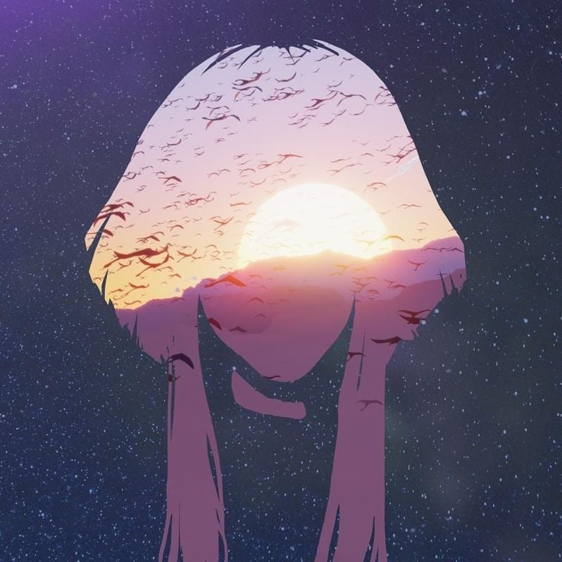

# Sky: Concert in the Light (Original Game Soundtrack)

- **Artist:** Aurora Aksnes, Vincent Diamante 
- **Duration:** 00:48:48
- **Genre:** Pop, Video Game
- **Release Date:** 08.12.2022
- **Label:** Decca (UMO)
- **Format:** 24-bit/48kHz FLAC

Sky: Concert in the Light first started as a virtual concert within the game of Sky: Children in the Light. From December 8, 2022 to January 2, 2023, thousands of players will be able to attend this experience in in the game together as the concert plays on a loop every four hours.

Sky: Children of the Light is an open world indie adventure game where players can explore the seven realms of a vast kingdom while connecting with loved ones.

### Aurora, The Music Artist
A true artistic collaboration with acclaimed Norwegian singer known for hits: 'Runaway', 'Cure for Me', 'Running with the Wolves' and Frozen II's, 'Into the Unknown'. She will take center stage, guiding concert-goers through this unprecedented musical journey.
